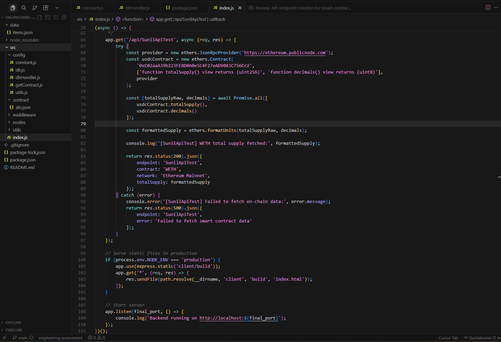
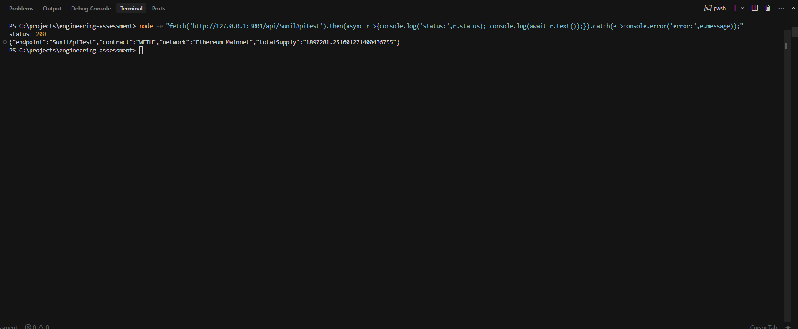

# Engineering Assessment Submission

Implemented a new API endpoint `GET /api/SunilApiTest` in `src/index.js` using `ethers.js`.

The endpoint connects to Ethereum mainnet through a public RPC and fetches data from the public WETH smart contract:
- Contract: `0xC02aaA39b223FE8D0A0e5C4F27eAD9083C756Cc2`
- Data fetched: `totalSupply()` + `decimals()`
- Output: JSON response in API + value logged in server console

## Run locally

```bash
npm install
npm start
```

## Proof Screenshots

### 1) Endpoint code in `src/index.js`


### 2) Terminal API JSON response


### 3) Server console log output


### 3) Contract deployed


## Video Proof

[Watch/Download screen recording](screenrecord.mp4)
